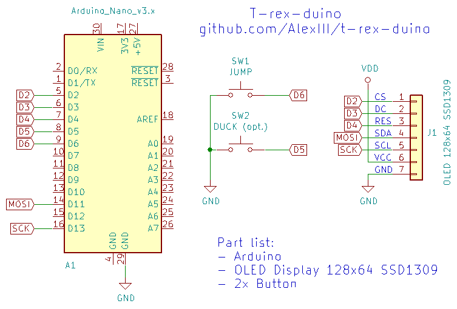
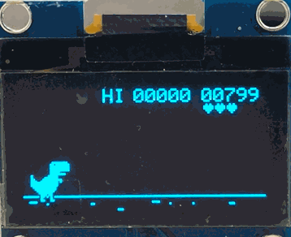
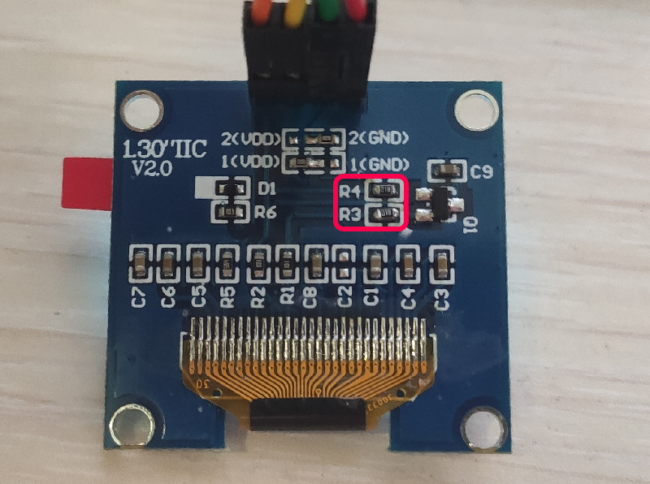
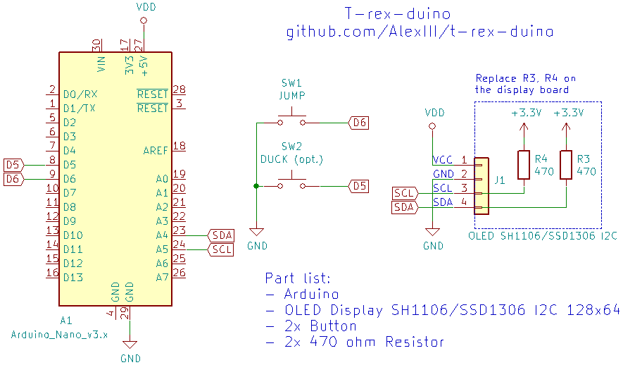

# T-Rex-duino


Clone of T-rex game from Chrome browser rewritten for Arduino.

Just 3 components needed:

- Arduino Uno / Nano / Pro Mini
- OLED display 128x64 SSD1309
- A button (or two, if you want to duck!)

[Youtube video](https://www.youtube.com/watch?v=635SnybBRD8)

**Update**

Now supporting SH1106/SSD1306 based I2C OLED display!

## Instructions

0. Assemble



1. Flash [that sketch](https://github.com/AlexIII/t-rex-duino/releases/download/v1.1/Arduino-sketch-t-rex-duino-v1.1.zip) to your Arduino
2. Play!
3. Repeat from step 2

## Using OLED display SH1106/SSD1306 I2C



0. In order to use SH1106/SSD1306 you will need to add two 470 ohm resistors to the display board. 
You can add these resistors right on top of 10k resistors that already present (or replace them).



1. Assemble



2. Select OLED display type at the beginning of `t-rex-duino.ino` sketch by uncommenting one of the following lines (SSD1309 selected by default).
```
//#define LCD_SSD1309
//#define LCD_SH1106
//#define LCD_SSD1306
```
Flash the sketch.

Note that in order to achieve desirable performance I2C is substantially overclocked (it works at 800kHz vs 400kHz as per display specification).
It is possible that not every display will work under these conditions.
The display I have works fine mostly, but a stray broken frame still appears now and then.
As much as I can assume **small artifacts are unavoidable with this display**.

## License

MIT License © github.com/AlexIII
