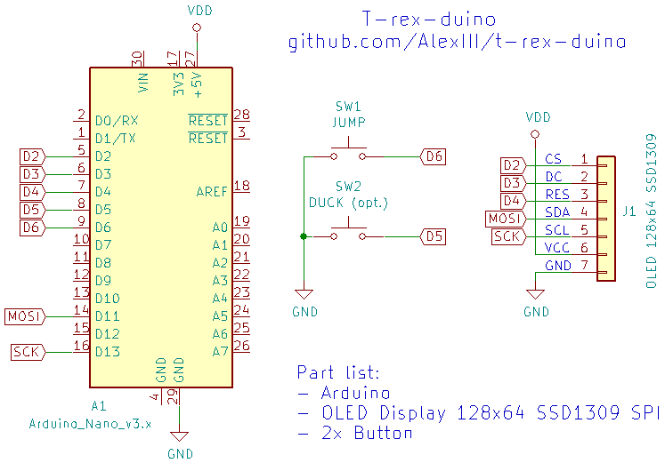

# T-Rex-duino

Clone of T-rex game from Chrome browser rewritten for Arduino.

Just 3 components needed:

- Arduino Uno / Nano / Pro Mini
- OLED display 128x64 SSD1309
- A button (or two, if you want to duck!)

[Youtube video](https://www.youtube.com/watch?v=635SnybBRD8)

## Instructions

0. Assemble

1. Flash [that sketch](https://github.com/AlexIII/t-rex-duino/releases/download/v1.0/Arduino-sketch-t-rex-duino-v1.0.zip) to your Arduino
2. Play!
3. Repeat from step 2

## License

MIT License © github.com/AlexIII
